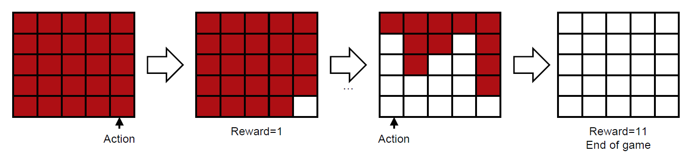
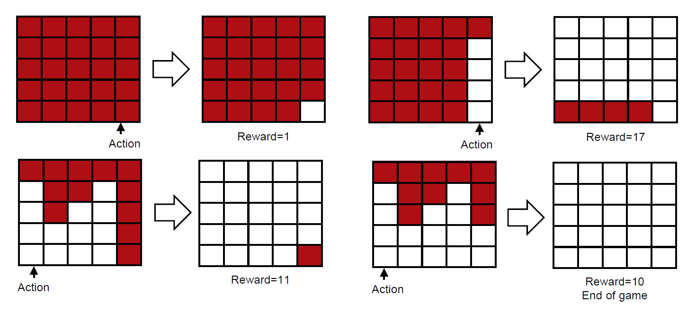
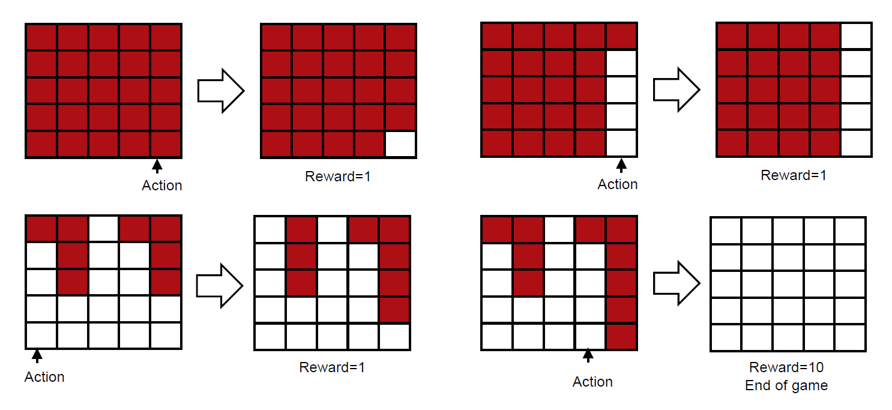

# Breakout Game
We train an agent to play a simple version of Breakout. There are 25 bricks in 5 rows and 5 columns. At each time, the agent can take one of 5 actions to remove the bottom brick in one of 5 columns. Unlike the original Breakout, there is no ball and thus you don't need to worry about losing a ball. A reward of 1 is given for removing a brick.

## DQN_breakout1

Figure. Example of state transition in environment 1.  
In environment 1, if any one of 5 columns is cleared, then all the remaining bricks are removed and you get a reward equal to the number of removed bricks. Therefore, an optimal policy for this environment is to clear any one of 5 columns. 

## DQN_breakout2

Figure. Example of state transition in environment 2.  
In environment 2, if any one of 5 columns is cleared, then all the remaining bricks in the upper 4 rows are removed and you get a reward equal to the number of removed bricks. Therefore, an optimal policy for this environment is to clear any one of 5 columns and then remove the remaining 4 bricks at the bottom row.

## DQN_breakout3

Figure. Example of state transition in environment 3.  
In environment 3, if any one of 5 columns is cleared, then all the remaining bricks are removed and you get a reward equal to the number of removed bricks. Therefore, an optimal policy for this environment is to clear any two consecutive columns. 

### About all breakout1,2,3 ...
* For all 3 environments, the total accumulate rewards is always 25 at the end of a game. Therefore, the goal is not to get a higher score, but to finish the game as soon as possible. If the discount factor 𝛾 is strictly less than 1, then reinforcement learning will try to learn to finish the game as quickly as possible.
* Since there are 6 possible states for each column, i.e., empty, only the top brick is present, only the top two bricks are present, …, and all 5 bricks are present, the total number of states is 6^5.
* A state is represented 3 different ways.
   * For storing a state in replay memory in DQN, we use a vector representation, i.e., s=[s_1,s_2,s_3,s_4,s_5], where s_i is 0~5 indicating the number of remaining bricks in the i-thcolumn.
   * For feeding a state to the neural network in DQN, we use a matrix representation that is 5x5 matrix of 0’s and 1’s indicating the presence of each brick. A vector representation can be converted to an equivalent matrix representation by using the function “matrix_state” in “state_representation.py”.
   * For Q learning, we use a scalar representation, i.e., s=0,…,6^5−1, where s=0 means no bricks and s=6^5−1means all bricks are present. A vector representation can be converted to an equivalent scalar representation by using the function “scalar_state” in “project2_state_representation.py”.
   

 
> This resource is based on EE488C Special Topics in EE <Deep Learning and AlphaGo> Fall 2016, School of EE, KAIST