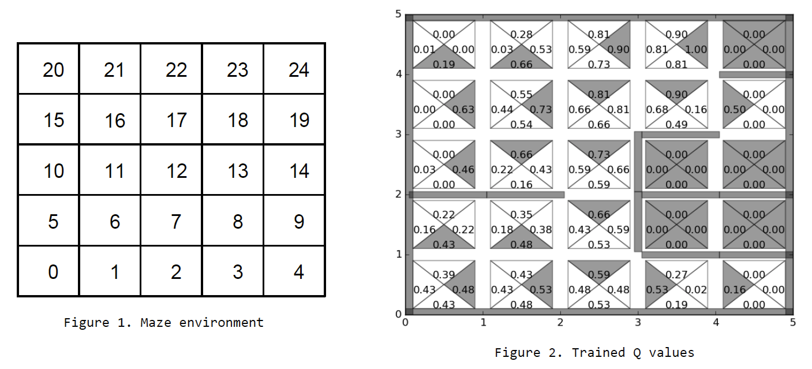
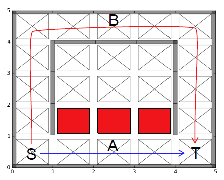

# Maze Game

## Task1 (simple environment)
In the task1, we build a 5 x 5 maze with **randomly constructed walls (p=0.2)** and understand how Q-learning works. The maze environment has 25 states, one for each cell, and the agent can perform one of four actions (up, down, left, right) at each state. If a movement is blocked by a wall, then the agent will stay in the current cell. States are numbered from 0 to 24. The starting state is state 0 and the terminal state is state 24. 

The goal of the agent is to reach the terminal state. When the agent reaches the terminal state, the agent gets a reward of 1 and the episode ends.

## Task2 (complex environment)
The starting state should be the left bottom corner "S" and the terminal state should be the right bottom corner "T". The 3 red cells in Fig. should give a reward of -100 whenever any of them is visited. When the agent reaches the terminal state, a reward of one should be given.

Q-learning will choose the shortest but more dangerous path "A" and Sarsa will choose a longer but safer path "B" at the end of training.

### Learning Algorithm for task2

Q-learning | SARSA
-----------|---------
Off-policy TD Control | On-policy TD Control

* Off-policy method evaluates or improves a policy different from that used to generate data.
* On-policy method evaluates or improves the policy that is being used to make decisions.

Algorithms are as follows: 

 
> EE488C Special Topics in EE <Deep Learning and AlphaGo>, Fall 2016 & Information Theory & Machine Learning Lab, School of EE, KAIST
& Wonseok Jeon and Sungik Choi (wonsjeon@kaist.ac.kr, si_choi@kaist.ac.kr)
